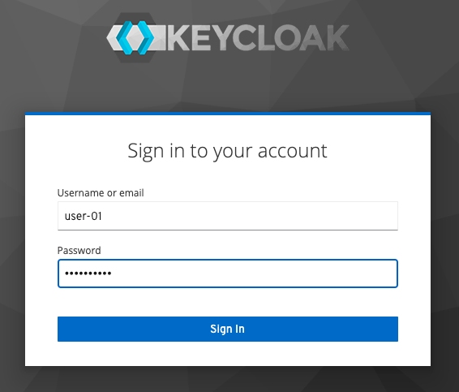

# nms-oidc
Reference Implementation of NGINX Management Suite(NMS) for OpenID Connect(OIDC) Authentication.

This repo is to manage the core NJS and sample configuration regarding the reference implementation of NMS OIDC. In addition to that you can find how to set up IdP, NGINX Plus and locally test OIDC flow in your machine before installing and configuring NMS products.

> Note: The main [`README.md`](https://github.com/nginxinc/nginx-openid-connect) of this repo explains several options in detail. But this doc focuses on `Start Guide` to quickly set up and test the OIDC flow locally using bundled frontend app and backend environment on behalf of NMS.


- [1. Prerequisites](#1-prerequisites)
- [2. Running a Keycloak Docker Container (Optional)](#2-running-a-keycloak-docker-container-optional)
- [3. Configuring Environment Variables and NGINX](#3-configuring-environment-variables-and-nginx)
- [4. Running a NMS-OIDC Simulaiton Docker Container](#4-running-a-nms-oidc-simulaiton-docker-container)
- [5. Running a Browser and Checking If Bundle Page Works](#5-running-a-browser-and-checking-if-bundle-page-works)
- [6. Setting up an Identity Provider (IdP)](#6-setting-up-an-identity-provider-idp)
- [7. Testing NGINX-NMS OIDC](#7-testing-nginx-nms-oidc)
- [8. Stop and Remove Docker Containers](#8-stop-and-remove-docker-containers)

## 1. Prerequisites

- [Install and Run Docker](https://docs.docker.com/engine/install/) in your local machine.

- Edit `hosts` file in your laptop via if you want to locally test NGINX Plus OIDC:

  ```bash
  $ sudo vi /etc/hosts or notepad.exe c:\Windows\System32\Drivers\etc\hosts

  127.0.0.1 www.example.com
  127.0.0.1 host.docker.internal
  ```

  > Note: The `host.docker.internal` is used for **Keycloak**. The `www.example.com` is used for any IdP.

- [Download NGINX Plus license files](https://www.nginx.com/free-trial-request/), and copy them to ./docker/build-context/ssl/

  ```bash
  nginx-repo.crt
  nginx-repo.key
  ```

- Clone the [nginx-openid-connect/nms-oidc](https://github.com/nginx-openid-connect/nms-oidc) GitHub repository, or download the repo files.

  ```bash
  git clone https://github.com/nginx-openid-connect/nms-oidc.git
  ```

## 2. Running a Keycloak Docker Container (Optional)

- Start a Docker container:

  ```bash
  $ make start-keycloak
  ```

  > Note:
  >
  > - In this example, a Keycloak container image (`jboss/keycloak:15.1.0`) is used.
  > - Please try another version of Keycloak container images in [`docker-compose.yml`](../docker-compose.yml) if you have any issue when starting it in your local machine.

  <br>

## 3. Configuring Environment Variables and NGINX

- Edit and run either `~/.bash_profile` or batch file in Windows:
  ```bash
  export AZURE_TENANT_ID=d106871e-7b91-4733-8423-xxxx
  export AZURE_CLIENT_ID=478bbf72-65c1-4878-9f5f-xxxx
  export AZURE_CLIENT_SECRET=crh8Q~z9mT7oxxxx
  export KEYCLOAK_CLIENT_SECRET=pEOW0ugyQ6O4Exxxxxx
  ```

- Edit environment variables in `var-azuread.env` and `var-keycloak.env` for Docker


- Edit NGINX configuration variables in `openid_configuration.conf`(./openid_configuration.conf):
  ```nginx
  map $host $oidc_client_credentials_flow_enable {
      # Both of Client Credentials Flow and AuthCode Flow are supported if enable.
      # Client Credentials Flow is executed if bearer token is in the API request
      # and this flag is enabled. Otherwise AuthCode Flow is executed.
      default 1;
  }

  map $host $oidc_client_credentials_token_body {
      SERVER_FQDN OIDC_CLIENT_CREDENTIALS_TOKEN_BODY;

      # Custom extra body in the token endpoint for Client Credentials Flow
      default "scope=$oidc_client/.default";
      #www.example.com "audience=https://dev-abcdefg.us.auth0.com/api/v2/";
  }
  ```

  > **Note:**
  > - Check the specification per each IdP if you want to support and test the Client Credentials Flow.
  > - Add additional parameters (e.g., `scope=xxx` for Azure AD and Keycloak or `audience=xxx` for Auth0 if needed.

## 4. Running a NMS-OIDC Simulaiton Docker Container

- Start a Docker container:

  ```bash
  $ make start
  ```

- Check Docker container's status:

  ```bash
  $ make watch
  ```

  


## 5. Running a Browser and Checking If Bundle Page Works

Run a Web Browser with the following URL, and check if the bundle frontend landing page is shown:

- Keycloak Test: `http://www.example.com:8010/`
- Azure AD Test: `https://www.example.com/`

  


## 6. Setting up an Identity Provider (IdP)

Choose one of your prefered IdPs, and set up your IdP by referencing the following guides:

- [Create and configure an app in Amazon Cognito](https://github.com/nginx-openid-connect/nginx-oidc-amazon-cognito/blob/main/docs/01-IdP-Setup.md)
- [Create and configure an app in Auto0](https://github.com/nginx-openid-connect/nginx-oidc-auth0/blob/main/docs/01-Auth0-Setup.md)
- [Create and configure an app in Azure AD](https://github.com/nginx-openid-connect/nginx-oidc-azure-ad/blob/main/docs/01-IdP-Setup.md)
- [Create and configure an app in Keycloak](https://github.com/nginx-openid-connect/nginx-oidc-keycloak/blob/main/docs/01-IdP-Setup.md)
- [Create and configure an app in Okta](https://github.com/nginx-openid-connect/nginx-oidc-okta/blob/main/docs/01-IdP-Setup.md)
- [Create and configure an app in OneLogin](https://github.com/nginx-openid-connect/nginx-oidc-onelogin/blob/main/docs/01-IdP-Setup.md)
- [Create and configure an app in Ping Identity](https://github.com/nginx-openid-connect/nginx-oidc-ping-identity/blob/main/docs/01-IdP-Setup.md)

> Notes:
>
> - In this example, **Keycloak** is used as it can be installed as one of Docker containers in your local machine.
>   - **Client ID**: `my-client-id`
>   - **Access Type**: `confidential` for PKCE
>   - **Valid Redirected URIs**:
>     - `http://www.example.com:8010/_codexch`
>     - `http://www.example.com:8010/_logout` (IdP callback URI is not supported yet for NMS. The callback URI is only supported for ACM as for now.)


## 7. Testing NGINX-NMS OIDC

- Click `Sign In` button:

  

  

- Click `Call a Sample Proxied API` button:

  

  > Note:
  >
  > - In the [`nms-http-simple.conf`](../nms-http-simple.conf), you can add additional API endpoints like:
  >
  >   ```nginx
  >   location /v1/private-api {
  >       auth_jwt "" token=$access_token;      # Use $session_jwt for Azure AD
  >       auth_jwt_key_request /_jwks_uri;      # Enable when using URL
  >
  >       proxy_set_header Authorization "Bearer $access_token";
  >       proxy_pass http://my_backend;
  >   }
  >   ```
  >
  > - So you can enter a different URI for testing your additional API endpoints via this bundled frontend tool.


## 8. Stop and Remove Docker Containers

- Stop Docker containers

  ```bash
  $ make down
  $ make down-keycloak
  ```

- Remove Docker container images

  ```bash
  $ make clean
  $ make clean-all
  ```
